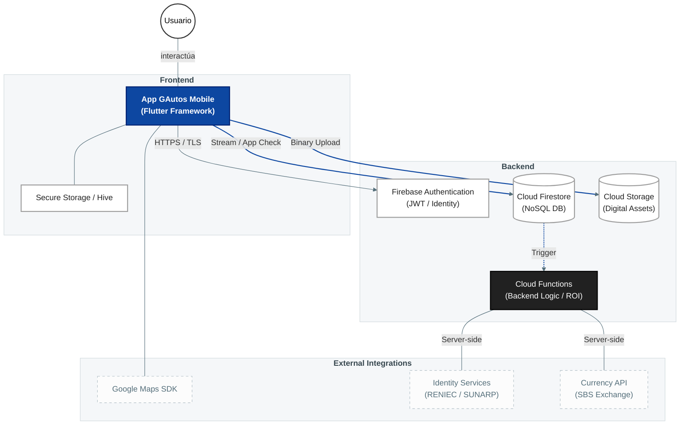

```mermaid
graph TD
    %% Definición de estilos
    classDef usuario fill:#ffffff,stroke:#333,stroke-width:2px,color:#000;
    classDef appNode fill:#0d47a1,stroke:#002171,stroke-width:2px,color:#fff,font-weight:bold;
    classDef logicNode fill:#212121,stroke:#000,stroke-width:2px,color:#fff;
    classDef storageNode fill:#ffffff,stroke:#9e9e9e,stroke-width:2px,color:#212121;
    classDef externalNode fill:#fcfcfc,stroke:#b0bec5,stroke-width:1px,color:#546e7a,stroke-dasharray: 5 5;
    
    %% Estilo de los contenedores (Quitando el amarillo)
    classDef subgStyle fill:#f5f7f9,stroke:#cfd8dc,stroke-width:1px,color:#37474f,font-weight:bold;

    %% Nivel 1: Usuario
    User(("Usuario")):::usuario

    %% Nivel 2: Frontend
    subgraph Frontend ["Frontend"]
        App["App GAutos Mobile<br/>(Flutter Framework)"]:::appNode
        Cache["Secure Storage / Hive"]:::storageNode
    end

    %% Nivel 3: Backend
    subgraph Backend ["Backend"]
        Auth["Firebase Authentication<br/>(JWT / Identity)"]:::storageNode
        Firestore[("Cloud Firestore<br/>(NoSQL DB)")]:::storageNode
        Storage[("Cloud Storage<br/>(Digital Assets)")]:::storageNode
        Functions["Cloud Functions<br/>(Backend Logic / ROI)"]:::logicNode
    end

    %% Nivel 4: API Externas
    subgraph Externos ["External Integrations"]
        Maps["Google Maps SDK"]:::externalNode
        Identity["Identity Services<br/>(RENIEC / SUNARP)"]:::externalNode
        Finance["Currency API<br/>(SBS Exchange)"]:::externalNode
    end

    %% Relaciones y Flujos
    User ---|interactúa| App
    App --- Cache

    %% Conexiones Seguras
    App ==>|HTTPS / TLS| Auth
    App ==>|Stream / App Check| Firestore
    App ==>|Binary Upload| Storage

    %% Lógica de Negocio
    Firestore -.->|Trigger| Functions
    
    %% Integraciones
    App --- Maps
    Functions ---|Server-side| Identity
    Functions ---|Server-side| Finance

    %% Aplicación de estilos a subgrafos
    class Frontend,Backend,Externos subgStyle;

    %% Estilo de las líneas
    linkStyle default stroke:#546e7a,stroke-width:1px;
    linkStyle 3,4,5 stroke:#0d47a1,stroke-width:2px;
```

