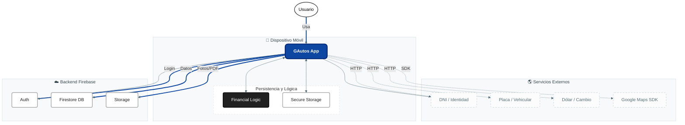

```mermaid
graph TD
    classDef userStyle fill:#ffffff,stroke:#333,stroke-width:2px,color:#000,rx:50,ry:50;
    classDef appStyle fill:#0d47a1,stroke:#002171,stroke-width:3px,color:#fff,font-weight:bold,rx:10,ry:10;
    classDef logicStyle fill:#212121,stroke:#000,stroke-width:2px,color:#fff,rx:5,ry:5;
    classDef infraStyle fill:#ffffff,stroke:#9e9e9e,stroke-width:2px,color:#212121,rx:5,ry:5;
    classDef apiStyle fill:#fcfcfc,stroke:#b0bec5,stroke-width:1px,color:#546e7a,stroke-dasharray: 5 5,rx:5,ry:5;
    classDef containerStyle fill:#f8f9fa,stroke:#cfd8dc,stroke-width:1px,color:#37474f;
    classDef subContainerStyle fill:#ffffff,stroke:#e0e0e0,stroke-width:1px,stroke-dasharray: 5 5;

    User(Usuario):::userStyle

    subgraph APIs [🌎 Servicios Externos]
        direction TB
        Identity[DNI / Identidad]:::apiStyle
        Vehicle[Placa / Vehicular]:::apiStyle
        Finance[Dólar / Cambio]:::apiStyle
        Maps[Google Maps SDK]:::apiStyle
    end

    subgraph Device [📱 Dispositivo Móvil]
        direction TB
        App[GAutos App]:::appStyle
        
        subgraph Local [Persistencia y Lógica]
            direction LR
            Logic[Financial Logic]:::logicStyle
            Cache[Secure Storage]:::infraStyle
        end
    end

    subgraph Cloud [☁️ Backend Firebase]
        direction TB
        Auth[Auth]:::infraStyle
        Firestore[Firestore DB]:::infraStyle
        Storage[Storage]:::infraStyle
    end

    User ==>|Usa| App

    App <--> Logic
    App <--> Cache

    App -.->|HTTP| Identity
    App -.->|HTTP| Vehicle
    App -.->|HTTP| Finance
    App -.->|SDK| Maps

    App ==>|Login| Auth
    App ==>|Datos| Firestore
    App ==>|Fotos/PDF| Storage

    Identity ~~~ App
    App ~~~ Auth

    class Device,Cloud,APIs containerStyle;
    class Local subContainerStyle;

    linkStyle default stroke:#546e7a,stroke-width:1px;
    linkStyle 0,7,8,9 stroke:#0d47a1,stroke-width:3px;
```

